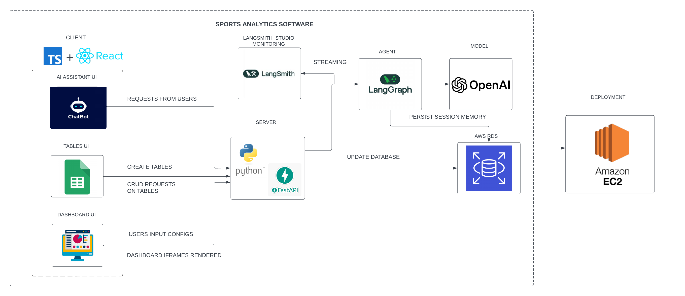

# 🏀 Sports Analytics Software

  
A no-code, AI-powered sports analytics platform for teams, coaches, and analysts

🔗 Live Demo: https://sportsanalytics.us
 (available until 01/01/2026)

## 📌 Overview

Sports Analytics Software is a full-stack, AI-powered web platform designed to help sports teams manage, analyze, and visualize performance data without requiring technical expertise.

The platform enables users to:

- Upload and manage structured sports data

- Query team and player statistics using natural language

- Embed analytics dashboards from popular tools

- Maintain strict data isolation per team

- Stream AI responses in real time

This project aims to lower the barrier to entry for sports analytics while maintaining production-grade architecture and security.

## 🧠 Core Features

📊 Interactive Table Management

📈 Analytics Dashboard Embedding

🤖 AI Assistant (Natural Language → SQL)

## 🧑‍💻 Team

Khanh Khuat, Ren Harris, Will Schneider, Quan Le, Long Nguyen, Jessie Tran